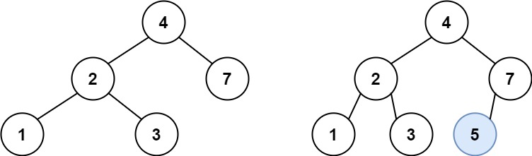
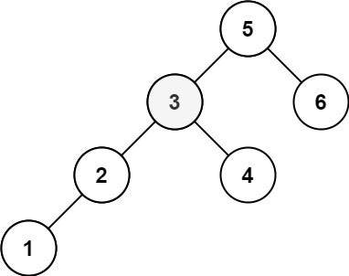

# Arbre binaire de recherche

Un **arbre binaire de recherche** (en anglais, _binary search tree_ ou _BST_) est un [arbre binaire](https://fr.wikipedia.org/wiki/Arbre_binaire) - chaque noeud de l'arbre possede au plus deux branches -
possédant les propriétés suivantes:

- pour chaque noeud, le sous _arbre de gauche_ posséde de clef _inferieur_ ou _égale_ à celle du noeud considéré.

- pour chaque noeud, le sous _arbre de droite_ posséde de clef _supérieur_ ou _égale_ à celle du noeud considéré.

Par exemple, l'arbre représenté ci dessous est un **abre binaire de recherche**:


En programation informatique, un _arbre binaire_ peut etre représenter par:

```typescript
class TreeNode {
  public value: number;
  public right?: TreeNode;
  public left?: TreeNode;
}

class BinarySearchTree {
  private root?: TreeNode;

  contructor(root: TreeNode = null) {
    this.root = root;
  }
}
```

## opération classique

#### exercice 1: ajout d'un noeud

Etant donné un _arbre binaire de recherche_, notre but est d'implementer la methode `insert(v: number)` qui ajoute un nouveau noeud dans l'arbre original.

**Attention, après insertion, l'arbre doit conserver les propriétés d'un arbre binaire de recherche.**

Par exemple:



```
input: tree = [4, 2, 7, 1, 3];  value = 5
output: tree = [4, 2, 7, 1, 3, 5]
```

#### exercice 2: parcours d'un arbre

Il existe 3 façons de parcourir un _arbre binaire de recherche_:

- **Inorder tree walk** : les noeuds de l'arbre de gauche sont d'abord parcourus, puis le noeud racine et enfin les noeuds de l'arbre de droite.

- **Preorder tree walk** : le noeud racine est d'abord visité, suivis des noeuds de l'arbre de gauche puis des noeuds de l'arbre de droite.

- **Postorder tree walk** : les noeuds de l'arbre de gauche sont d'abord parcouru, puis les noeuds de l'arbre de droite, et enfin le noeud racine.

Notre but est d'implementer ces 3 parcours (`inorder`, `preorder`, `postorder`).

Les resultats du parcours seront données sous forme de liste. Si l'arbre est `null`, on retournera un liste vide.

Par exemple:


```
inorder output: [1,2, 3, 4, 5, 7]

preorder output: [5, 2, 1, 3, 4, 7]

postorder output: [1, 3, 4, 2 , 7, 5]
```

> un parcour _inorder_ dans un _arbre binaire de recherche_ parcour les noeuds dans l'ordre croissant de leur valeur.

#### exercice 3: recherche

Notre but est de determiner si oui ou non une valeur est presente dans un _abre binaire de recherche_.

Par exemple:


```
input: root = [4,2,7,1,3], val = 5
output: False

input: root = [4,2,7,1,3], val = 7
output: True
```

#### exercice 4: suppression d'un noeud

Notre but est de supprimer un noeud par sa valeur dans un arbre binaire de recherche. notre function doit retourner le nouvelle arbre avec le noeud supprimé.
Si le noeud n'est pas present, l'arbre original est retourné.

**Attention, après suppression, l'arbre doit conserver les propriétés d'un arbre binaire de recherche.**

Par exemple:


```
Input: root = [5,3,6,2,4,7], key = 3
Output: [5,4,6,2,7]
```

## complements

#### exercice 5: somme dans un arbre.

Etant donné un _arbre binaire de recherche_ et deux nombres `low` et `high`, notre but est de calculer la somme des valeurs des noeuds comprises entre `[low, high]`.

**Attention: les valeurs `low` et `high` sont incluses dans le calcul de la somme**

Par exemple:


```
Input: root = [10,5,15,3,7,18], low = 7, high = 15
Output: 32
```

#### exercice 6: k-ieme element

Etant donné un _arbre binaire de recherche_ et un entier naturel `k`, notre but est de retourner la `k-ieme` plus petite valeur parmis l'ensemble des noeud de notre arbre.

Par exemple:


```
Input: root = [3,1,4,2], k = 1
Output: 1
```



```
Input: root = [5,3,6,2,4,1], k = 3
Output: 3
```

### exercice 7: balance

Un _arbre binaire_ est dit _height-balanced_ lorsque la profondeur des deux sous arbre differe au plus 1 pour chaque noeud.

Etant donné un _arbre binaire_, notre but est de determiner si notre arbre est balancé ou non.

Par exemple:


```
Input: root = [3,9,20,15,7]
Output: true
```


```
Input: root = [1,2,2,3,3,4,4]
Output: false
```
